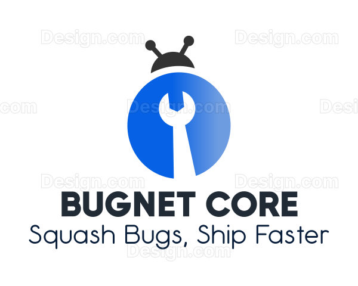

# BugNet Core


<br/>
<div align="center">
  <a href="https://github.com/AhmedYassinH/BugNet-Core">
    
  </a>

  <h3 align="center">BugNet Core</h3>

  <p align="center">
    BugNet Core is a comprehensive, real-time bug tracking system designed to streamline the process of managing and resolving software issues. Built with modern web technologies, it offers a robust solution for development teams to efficiently handle bug reports, collaborate in real-time, and provide live support to customers.
    <br />
    <br />
    <a href="https://github.com/AhmedYassinH/BugNet-Core/tree/main/docs">Docs</a>
    ·
    <a href="https://ahmedyassin.dev/">View Demo</a>
  </p>
    <br />
</div>


## Software Requirements Documentation - SRS

For the detailed Software Requirements documentation, see the [SRS Document](./docs/Software%20Requirements%20Specifications%20Doc%20-%20BugNet%20Core.md).

## API Documentation

For the detailed API documentation, see the [API Design Document](./docs/API%20Design%20Document.md).

## Features

- **User Management**: Role-based access control for Admins, Developers, and Customers
- **Project Management**: Create and manage multiple projects
- **Bug Tracking**: Detailed bug reporting and tracking system
- **Real-time Notifications**: Instant updates on bug status changes and new comments
- **Live Support**: Real-time chat functionality for urgent customer support
- **Comment System**: Threaded comments on bug reports for effective communication
- **RESTful API**: Well-documented API for easy integration with other tools
- **WebSocket Integration**: Real-time updates and chat functionality
- **Responsive Design**: Mobile-friendly user interface

## Technologies Used

- **Backend**: ASP.NET Core
- **Frontend**: React
- **Database**: SQL Server
- **ORM**: Entity Framework Core
- **Real-time Communication**: SignalR
- **Authentication**: JSON Web Tokens (JWT)
- **API Documentation**: Swagger/OpenAPI

## Getting Started

### Prerequisites

- .NET 8.0 SDK
- Node.js and npm
- SQL Server

### Installation

1. Clone the repository:
   ```
   git clone https://github.com/yourusername/bugnet-core.git
   ```

2. Navigate to the backend directory and restore packages:
   ```
   cd bugnet-core/backend
   dotnet restore
   ```

3. Set up the database:
   ```
   dotnet ef database update
   ```

4. Start the backend server:
   ```
   dotnet run
   ```

5. Navigate to the frontend directory and install dependencies:
   ```
   cd ../frontend
   npm install
   ```

6. Start the frontend development server:
   ```
   npm start
   ```

7. Open your browser and visit `http://localhost:3000` to access the application.

## API Documentation

API documentation is available via Swagger UI. After starting the backend server, visit `http://localhost:5000/swagger` to explore the API endpoints.

## Contributing

Contributions to BugNet Core are welcomed :). Any contributions you make are **greatly appreciated**.

If you have a suggestion that would make this better, please fork the repo and create a pull request. You can also simply open an issue with the tag "enhancement".

<span style="color:rgb(243, 123, 132)">Don't forget to give the project a star!</span>

1. Fork the Project
2. Create your Feature Branch (`git checkout -b feature/AmazingFeature`)
3. Commit your Changes, make sure to follow the [Conventional Commits specification](https://www.conventionalcommits.org/en/v1.0.0/) (`git commit -m 'feat(optional_scope): add some AmazingFeature'`)
4. Push to the Branch (`git push origin feature/AmazingFeature`)
5. Open a Pull Request

## License

This project is licensed under the MIT License - see the [LICENSE.md](LICENSE.md) file for details.

## Acknowledgments

- [ASP.NET Core](https://docs.microsoft.com/en-us/aspnet/core/)
- [React](https://reactjs.org/)
- [SignalR](https://docs.microsoft.com/en-us/aspnet/core/signalr/introduction)
- [Entity Framework Core](https://docs.microsoft.com/en-us/ef/core/)